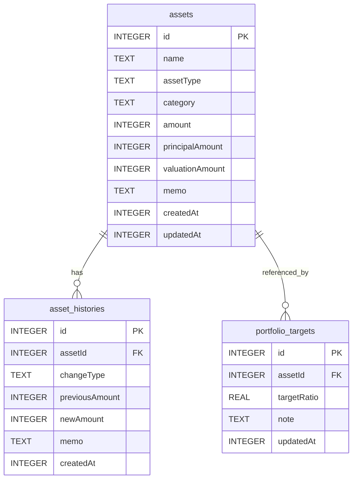

# 데이터 모델 및 ERD

## 1. 설계 개요

이 앱은 Room(SQLite) 기반 로컬 데이터베이스를 사용한다. 사용자가 자산을 수기로 DB에 넣을 필요는 없고, Kotlin Entity 정의만으로 앱 실행 시 테이블이 생성된다.

핵심 데이터는 자산 정보, 자산 변경 이력, 포트폴리오 목표 비율로 구성한다.

## 2. ERD



## 3. 테이블 정의

### 3.1 `assets`

자산과 부채의 현재 상태를 저장한다.

| 컬럼 | 타입 | 제약 | 설명 |
| --- | --- | --- | --- |
| id | Long | PK, AutoGenerate | 자산 고유 ID |
| name | String | NOT NULL | 자산명 |
| assetType | AssetType | NOT NULL | ASSET, LIABILITY |
| category | AssetCategory | NOT NULL | CASH, SAVINGS, INVESTMENT, LIABILITY, ETC |
| amount | Long | NOT NULL, 0 이상 | 현재 금액 또는 부채 금액 |
| principalAmount | Long? | nullable | 투자자산 매입금액 |
| valuationAmount | Long? | nullable | 투자자산 평가금액 |
| memo | String? | nullable | 메모 |
| createdAt | Long | NOT NULL | 생성 시각 |
| updatedAt | Long | NOT NULL | 수정 시각 |

### 3.2 `asset_histories`

변경 이력을 저장한다.

| 컬럼 | 타입 | 제약 | 설명 |
| --- | --- | --- | --- |
| id | Long | PK, AutoGenerate | 이력 고유 ID |
| assetId | Long | FK | 연결된 자산 ID |
| changeType | ChangeType | NOT NULL | CREATED, UPDATED, DELETED, VALUATION_UPDATED |
| previousAmount | Long? | nullable | 변경 전 금액 |
| newAmount | Long? | nullable | 변경 후 금액 |
| memo | String? | nullable | 변경 사유 |
| createdAt | Long | NOT NULL | 이력 생성 시각 |

### 3.3 `portfolio_targets`

대시보드 경고나 자산군 목표 비율을 기록하는 선택 테이블이다.

| 컬럼 | 타입 | 제약 | 설명 |
| --- | --- | --- | --- |
| id | Long | PK, AutoGenerate | 메모 ID |
| assetId | Long | FK | 대상 자산 |
| targetRatio | Double | 0.0~100.0 | 목표 비율 |
| note | String? | nullable | 경고 또는 가이드 문구 |
| updatedAt | Long | NOT NULL | 수정 시각 |

## 4. Enum 정의

### AssetType

| 값 | 의미 |
| --- | --- |
| ASSET | 자산 |
| LIABILITY | 부채 |

### AssetCategory

| 값 | 의미 |
| --- | --- |
| CASH | 현금성 자산 |
| SAVINGS | 예적금 |
| INVESTMENT | 투자자산 |
| LIABILITY | 부채 |
| ETC | 기타 |

### ChangeType

| 값 | 의미 |
| --- | --- |
| CREATED | 자산 생성 |
| UPDATED | 자산 정보 수정 |
| DELETED | 자산 삭제 |
| VALUATION_UPDATED | 평가금액 수정 |

## 5. 계산 규칙

### 총자산

```text
총자산 = ASSET 타입 자산의 currentValue 합계
currentValue = valuationAmount가 있으면 valuationAmount, 아니면 amount
```

### 총부채

```text
총부채 = LIABILITY 타입 자산의 amount 합계
```

### 순자산

```text
순자산 = 총자산 - 총부채
```

### 투자 수익률

```text
평가손익 = valuationAmount - principalAmount
수익률(%) = 평가손익 / principalAmount * 100
```

`principalAmount`가 0이거나 null이면 수익률은 계산하지 않고 화면에는 `-`로 표시한다.

## 6. DAO 책임

### AssetDao

| 메서드 | 역할 |
| --- | --- |
| getAllAssets() | 자산 목록 조회 |
| getAsset(id) | 자산 상세 조회 |
| insert(asset) | 자산 추가 |
| update(asset) | 자산 수정 |
| delete(asset) | 자산 삭제 |

### AssetHistoryDao

| 메서드 | 역할 |
| --- | --- |
| getHistories(assetId) | 자산별 이력 조회 |
| insert(history) | 이력 추가 |
| deleteByAssetId(assetId) | 자산 이력 삭제 |

### PortfolioTargetDao

| 메서드 | 역할 |
| --- | --- |
| getTargets() | 포트폴리오 목표 비율 조회 |
| upsert(target) | 목표 비율 저장 또는 수정 |

## 7. Repository 책임

`AssetRepository`는 UI가 직접 DAO를 만지지 않도록 중간에서 다음 역할을 담당한다.

- 자산 추가 시 생성 이력 저장
- 자산 수정 시 변경 전후 금액 비교 후 이력 저장
- 자산 삭제 전 삭제 이력 저장
- 대시보드 집계 계산
- 투자자산 수익률 계산값 제공
